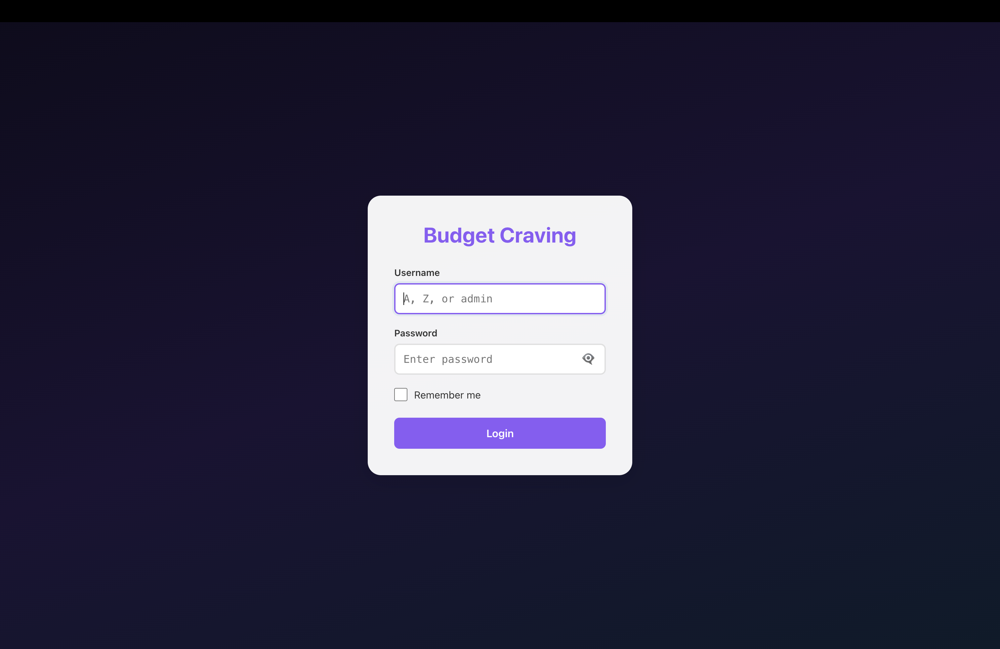
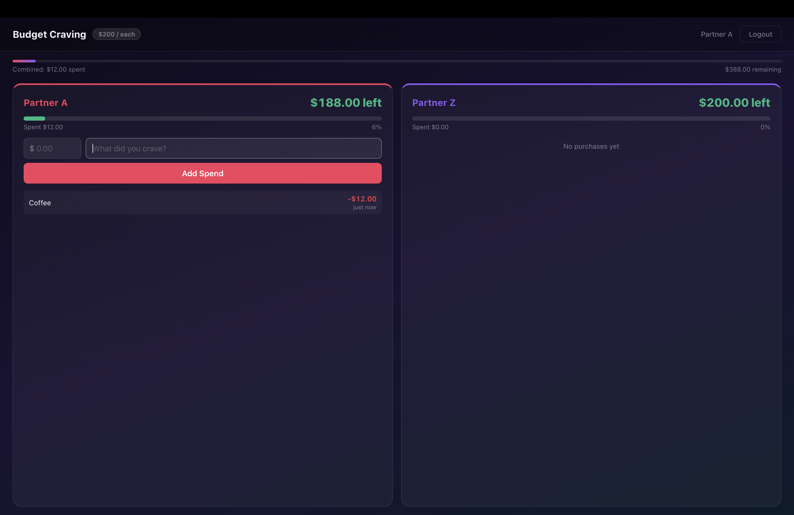
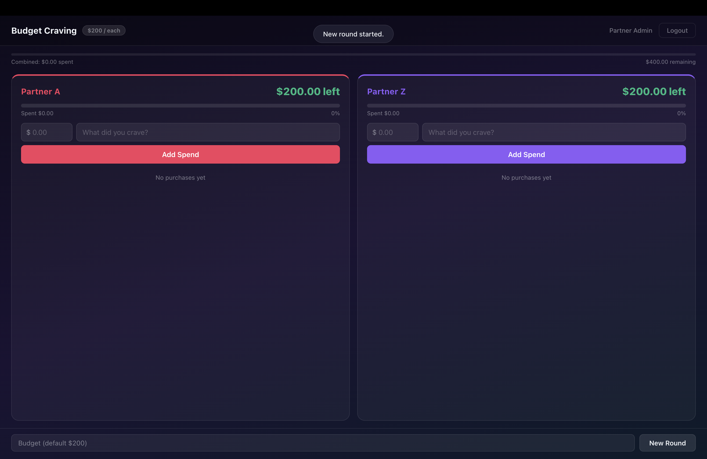

# Craving Duel

A real-time shared budget game for two players — built as a full-stack web application deployable on a **Raspberry Pi** or any server.

Each partner gets the same starting budget and logs what they spend throughout the day. Whoever exhausts their budget first is declared "more craving" and loses. An admin can configure the budget, monitor both players, and start new rounds.

> Built with Python FastAPI + React TypeScript + JWT authentication + PWA — the same stack used to deploy real-time AI inference endpoints at the edge.

---

## Screenshots

### Login


### Player view — spending in progress


### Admin view — managing both players


---

## How it works

- **Two players** (Partner A and Partner Z) each receive the same budget (default $500)
- Each player logs their purchases: amount + description ("What did you crave?")
- Every spend is validated server-side against that player's remaining budget
- The game ends when either player hits $0 — that player is the "more craving" loser
- **Admin** can watch both sides, spend on behalf of either player, and start a new round with a custom budget
- All other players see each other's updates in real time via polling

---

## Tech stack

| Layer | Technology |
|-------|-----------|
| Backend | Python 3.8+, FastAPI, Uvicorn, PyJWT, Pydantic v1 |
| Frontend | React 18, TypeScript, Vite, Axios |
| Auth | JWT (HS256), role-based access control enforced server-side |
| PWA | Service Worker, offline caching, installable on iOS and Android |
| Persistence | JSON file — survives server restarts without a database |
| Deployment | Raspberry Pi, systemd, mDNS (`.local` hostname) |
| Security | TLS auto-detection — HTTPS if certs present, HTTP otherwise |

---

## Roles

| Username | Role | Can do |
|----------|------|--------|
| `A` | Player | Log spends against their own budget |
| `Z` | Player | Log spends against their own budget |
| `admin` | Admin | View and spend for both players, reset game, set custom budget |

---

## Quick start

**Requirements:** Python 3.8+, Node.js 18+

```bash
git clone https://github.com/yourusername/budget-craving.git
cd budget-craving
```

**Backend:**

```bash
cd backend
python3 -m venv venv && source venv/bin/activate
pip install -r requirements.txt
cp .env.example .env   # set your passwords and SECRET_KEY
python3 main.py
```

**Frontend** (separate terminal):

```bash
cd frontend
npm install
npm run dev
```

Or run both at once from the project root:

```bash
npm install && npm run dev
```

App: `http://localhost:5173` — API docs: `http://localhost:8000/docs`

---

## Configuration

Copy `backend/.env.example` to `backend/.env` and set:

```ini
SECRET_KEY=<generate with: python3 -c "import secrets; print(secrets.token_hex(32))">
USER_A_PASSWORD=your-password
USER_Z_PASSWORD=your-password
ADMIN_PASSWORD=your-admin-password
DEFAULT_BUDGET=500   # starting budget per player
```

---

## API endpoints

All routes are prefixed with `/api`.

```
GET   /api/health           Health check (no auth)

POST  /api/auth/login       Login → JWT
GET   /api/auth/me          Current user info

GET   /api/game/state       Full game state (budgets, transactions, game over status)
POST  /api/game/spend       Log a spend  { amount, description, player? }
POST  /api/game/reset       Reset game   { budget? }  — admin only
```

Interactive docs at `http://localhost:8000/docs`.

---

## Project structure

```
budget-craving/
├── backend/
│   ├── main.py            # FastAPI app — auth, RBAC, game logic, static serving
│   ├── requirements.txt
│   └── .env.example
├── frontend/
│   ├── src/
│   │   ├── components/
│   │   │   └── Counter.tsx     # SpendCard — budget bar, spend form, transaction list
│   │   ├── pages/
│   │   │   ├── Setup.tsx       # Auto-discovers backend URL on first launch
│   │   │   ├── Login.tsx       # JWT authentication
│   │   │   └── Main.tsx        # Game interface — two player cards + game-over overlay
│   │   └── App.tsx             # State machine: setup → login → game
│   └── public/
│       └── sw.js               # Service Worker for offline caching
├── counter-app.service    # systemd unit for Raspberry Pi auto-start
├── network-info.sh        # Prints all network access URLs
└── start.sh               # One-command startup
```

---

## Raspberry Pi deployment

Deploy to a Pi so anyone on your WiFi can play from their phone — no app install needed.

```bash
# On the Pi
git clone https://github.com/yourusername/budget-craving.git
cd budget-craving

# Backend
cd backend
python3 -m venv venv && source venv/bin/activate
pip install -r requirements.txt
cp .env.example .env && nano .env

# Frontend build
cd ../frontend
npm install && npm run build

# Start
cd .. && ./start.sh
```

Access from any device on the same network:

```
http://raspberrypi.local:8000
```

The `.local` hostname uses mDNS (Bonjour / Avahi) — it keeps working even when the Pi's IP changes after a router restart.

**Auto-start on boot:**

```bash
sudo cp counter-app.service /etc/systemd/system/
sudo systemctl daemon-reload
sudo systemctl enable counter-tracker
sudo systemctl start counter-tracker
```

---

## Global access

Expose your Pi to the internet — no port forwarding or static IP needed.

**Cloudflare Tunnel (free, permanent URL):**
```bash
cloudflared tunnel --url http://localhost:8000
```

**Tailscale (private VPN mesh):**
```bash
curl -fsSL https://tailscale.com/install.sh | sh && sudo tailscale up
```

**ngrok (quick demo):**
```bash
ngrok http 8000
```

---

## PWA — install on mobile

**iPhone (Safari):** Share → Add to Home Screen
**Android (Chrome):** Menu → Install app

The app loads from the service worker cache when offline. Counter updates still require a connection.

See [IOS_PWA.md](IOS_PWA.md) for details.

---

## Architecture highlights

- **Stateless JWT auth** — roles embedded in token, verified on every request
- **Server-side RBAC** — Player A literally cannot write to Player Z's budget regardless of client payload
- **TLS auto-detection** — place `cert.pem` + `key.pem` in `backend/` and the server starts on HTTPS automatically
- **mDNS service discovery** — frontend probes `localhost` then `raspberrypi.local` on first launch; saves the URL to `localStorage` so users never type an address
- **Single-port production** — FastAPI serves the built React app as static files on port 8000; no nginx needed

See [ARCHITECTURE.md](ARCHITECTURE.md) for the full technical breakdown.

---

## Possible extensions

| Feature | How |
|---------|-----|
| WebSocket live updates | Replace polling with `fastapi.WebSocket` — mirrors LLM token streaming pattern |
| Persistent history | SQLite via SQLAlchemy async — same pattern as a vector DB for RAG |
| LLM commentary | Call OpenAI API on each spend, stream a reaction to the UI |
| Docker deployment | Single `docker-compose.yml` — backend + frontend build stage |
| Prometheus metrics | `prometheus-fastapi-instrumentator` — request count, latency, spend rate |

---

## License

MIT
